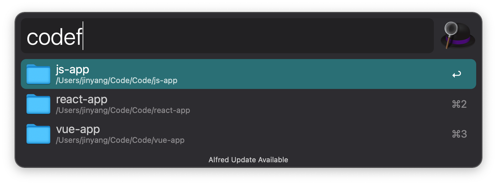

# Alfred workflow for VS Code CLI

An Alfred 4 workflow for Visual Studio Code Command Line Interface (CLI).



## Feature

- 📂 Open Folder with VS Code
- and more ...

## Installation

1. Install package

```shell
npm install @amifed/alfred-workflow-vscode -g
```

2. Download the workflow

3. Double click the .alfredworkflow file to install

> Note that the Alfred Powerpack is required to use workflows.

## Requirement

- Nodejs >= 14.17.1
- Visual Studio Code Command Line

## Usage

First of all, recommend you set workflow environment variables for better search:

Open the environment variables setting dialog of VS Code workflow, and configure

- CODEDIR_PATH, `required`, `default=$USER`, Directory path of project folders

### Search & Open

1. Use the keyword `codef` to trigger the workflow
2. Type your folder to search
3. Select the folder you want to open and press enter
